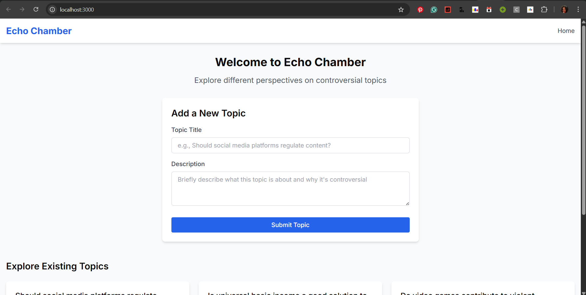
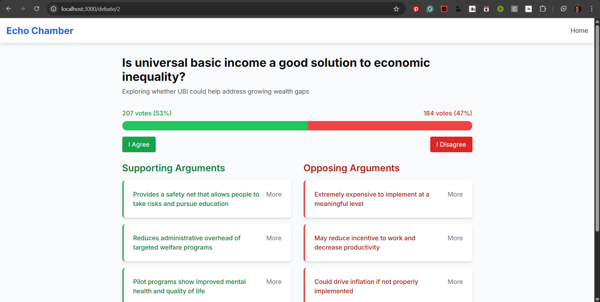
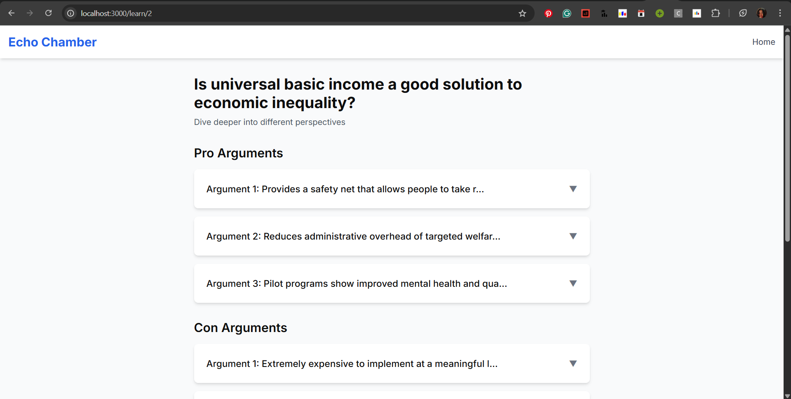

# 🔄 Echo Chamber - Opposing View Finder
[_Click on me to visit_](https://echochamber-rho.vercel.app/)

## 📝 Description

Echo Chamber is an interactive React application designed to break users out of their information bubbles by presenting balanced perspectives on controversial topics. In today's polarized media landscape, people often only consume content that reinforces their existing beliefs, creating "echo chambers" that limit exposure to diverse viewpoints. This application addresses this problem by showing arguments from multiple sides of contentious issues, helping users develop a more nuanced understanding of complex debates.

Users can explore pre-loaded controversial topics or submit their own for discussion. Each topic features color-coded pro and con arguments, interactive voting, and expandable cards for deeper exploration. The goal is to promote critical thinking and help users appreciate the complexity of divisive issues.

## ✨ Features

- **Topic Exploration & Submission**
  - Browse through existing controversial topics with balanced viewpoints
  - Submit new topics through a validated form interface
  - Clean, intuitive UI for easy navigation

- **Multi-Perspective Debate Pages**
  - Color-coded pro/con arguments (green for supporting, red for opposing)
  - Interactive voting system with real-time percentage display
  - Clear visual distinction between different viewpoints

- **In-Depth Learning Resources**
  - Expandable argument cards with detailed explanations
  - Source citations for each perspective
  - Additional reading materials and references

- **Modern User Experience**
  - Responsive design for seamless use across mobile and desktop
  - Accessible interface with clear typography and color contrast
  - Smooth navigation between different sections of the application

## 🛠️ Tech Stack

| Technology | Purpose |
|------------|---------|
| **React.js** | Front-end library built with functional components and hooks |
| **React Router** | Navigation and routing between multiple pages |
| **Context API** | State management across components |
| **Tailwind CSS** | Utility-first CSS framework for responsive design |
| **Mock API** | Simulated backend for data persistence |
| **NPM** | Package management |

## 🚀 Setup Instructions

### Prerequisites
- Node.js (v14.0 or later)
- npm (v6.0 or later)
- tailwindcss (below v4.0)

### Installation

1. **Clone the repository**
   ```bash
   git clone https://github.com/your-username/echo-chamber.git
   cd echo-chamber
   ```

2. **Install dependencies**
   ```bash
   npm install
   ```

3. **Set up Tailwind CSS**
   ```bash
   npx tailwindcss init -p
   ```

4. **Start the development server**
   ```bash
   npm start
   ```

5. **Access the application**
   Open your browser and navigate to `http://localhost:3000`

### Build for Production

```bash
npm run build
```

This creates a `build` directory with production-optimised files that can be deployed to hosting services.
- For Vercel: `vercel --prod`
- For Netlify: Connect your GitHub repository in the Netlify dashboard

## Application Structure

```
Directory structure:
└── echo_chamber/
  ├── README.md           # Description, features, setup instructions, & Tech Stack
  ├── src/
  │   ├── components/     # Reusable UI components
  │   ├── context/        # React Context for state management
  │   ├── pages/          # Main route components
  │   ├── services/       # API and data handling
  │   ├── App.jsx         # Root component
  │   └── index.js        # Entry point
  └── public/             # Static assets
```

## 📸 Screenshots


*The home page allows users to submit new topics or browse existing ones*


*The debate page presents balanced arguments on both sides of an issue. Neatly colour-coded to enable a more intuitive UI*


*The Learn More page provides detailed information and references*


## Deployment

This project has been deployed using vercel. It can be deployed to various other hosting platforms like:

- **Netlify**: Excellent for continuous deployment
- **GitHub Pages**: Good option for project showcasing

## 🔮 Future Enhancements

- 👤 User authentication for personalized experience
- 💬 Comment system for community discussions
- 📰 Integration with real news APIs for live arguments
- 🏷️ Topic categorization and filtering
- ✅ Fact-checking integration using API
- 📊 Advanced analytics on opinion distribution
- 📱 Mobile app version

## ⚡Upcoming features

- Backend integration to store real-time data.
- User login and authentication.
- Argument presentation during topic addition.
- Fact-checking integration

## 🤝 Contributing

Contributions are welcome! Please feel free to submit a Pull Request.

1. Fork the repository
2. Create your feature branch (`git checkout -b feature/amazing-feature`)
3. Commit your changes (`git commit -m 'Add some amazing feature'`)
4. Push to the branch (`git push origin feature/amazing-feature`)
5. Open a Pull Request

# Happy Coding!
